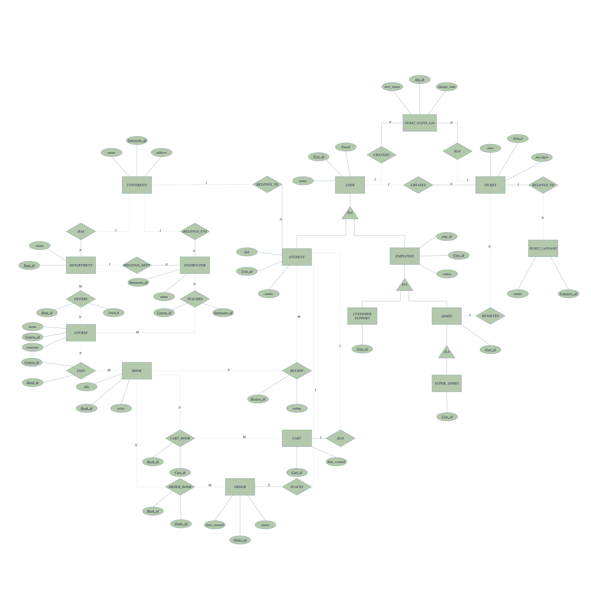

# 📘 GyanPustak Management System

## 🔹 Overview
GyanPustak is a database-driven web application designed to manage academic books, users, orders, and support workflows within a university ecosystem. The system allows students to browse and purchase books, while administrators and support staff manage inventory and resolve issues through a structured ticketing system.

The application is built using Flask (Python) and MySQL, with a modular backend design and role-based access control.

---

## 🔹 Features

### 👨‍🎓 Student
- Register and login securely  
- Browse and search books  
- Add books to cart  
- Place orders  
- View order history  
- Raise support tickets  
- Submit reviews  

### 🛠 Customer Support
- View all raised tickets  
- Assign tickets to specific admins  
- Track ticket progress  

### 👨‍💼 Admin
- Manage only assigned tickets (RBAC)  
- Update ticket status  
- Add, edit, and delete books  
- View and process orders  

### 👑 Super Admin
- Manage admins and support staff  
- Full control over system operations  

---

## 🔹 Tech Stack
- Backend: Flask (Python)  
- Database: MySQL  
- Frontend: HTML, CSS (Jinja Templates)  
- Authentication: Werkzeug (Password Hashing)  

---

## 🔹 Project Structure

PROJECT_GYANPUSTAK/

│
├── app.py  
├── requirements.txt  
├── .gitignore  

├── database/  
│   ├── schema.sql  
│   └── seed.sql  

├── design/  
│   └── er_diagram.png  

├── static/  
│   └── css/  
│       └── style.css  

├── templates/  
│   ├── base.html  
│   ├── home.html  
│   ├── login.html  
│   ├── register.html  
│   ├── books.html  
│   ├── book_detail.html  
│   ├── cart.html  
│   ├── orders.html  
│   ├── order_detail.html  
│   ├── profile.html  
│   ├── tickets.html  
│   ├── support_dashboard.html  
│   ├── support_tickets.html  
│   ├── admin_dashboard.html  
│   ├── admin_books.html  
│   ├── admin_add_book.html  
│   ├── admin_edit_book.html  
│   ├── admin_courses.html  
│   ├── admin_orders.html  
│   ├── admin_employees.html  
│   ├── admin_universities.html  
│   ├── admin_tickets.html  
│   └── admin_ticket_detail.html  

---

## 🔹 Database Design
- Designed using ER modeling  
- Contains 22 relational tables  
- Implements foreign key constraints and normalization  
- Supports role-based user hierarchy  

---

## 🔹 ER Diagram

---

## 🔹 Setup Instructions

### 1. Clone the repository
git clone https://github.com/YOUR_USERNAME/gyanpustak-project.git  
cd gyanpustak-project  

### 2. Install dependencies
pip install -r requirements.txt  

### 3. Configure environment variables

Create a `.env` file:

DB_HOST=localhost  
DB_USER=root  
DB_PASSWORD=yourpassword  
DB_NAME=gyanpustak  
SESSION_SECRET=your_secret  

### 4. Setup Database

Open MySQL and run:

CREATE DATABASE gyanpustak;  
USE gyanpustak;  

SOURCE database/schema.sql;  
SOURCE database/seed.sql;  

### 5. Run the application
python app.py  

---

## 🔹 Core Concepts Implemented
- Role-Based Access Control (RBAC)  
- Relational Database Design  
- Foreign Key Integrity  
- Cart & Order Management  
- Ticket Assignment Workflow  
- Dynamic Query Handling  

---

## 🔹 Highlights
- End-to-end workflow: Browse → Cart → Order → Support  
- Strict role-based permissions  
- Modular and scalable backend  
- Fully functional multi-user system  

---

## 🔹 Future Improvements
- UI/UX enhancements  
- Payment gateway integration  
- Email notifications  
- Analytics dashboard  
